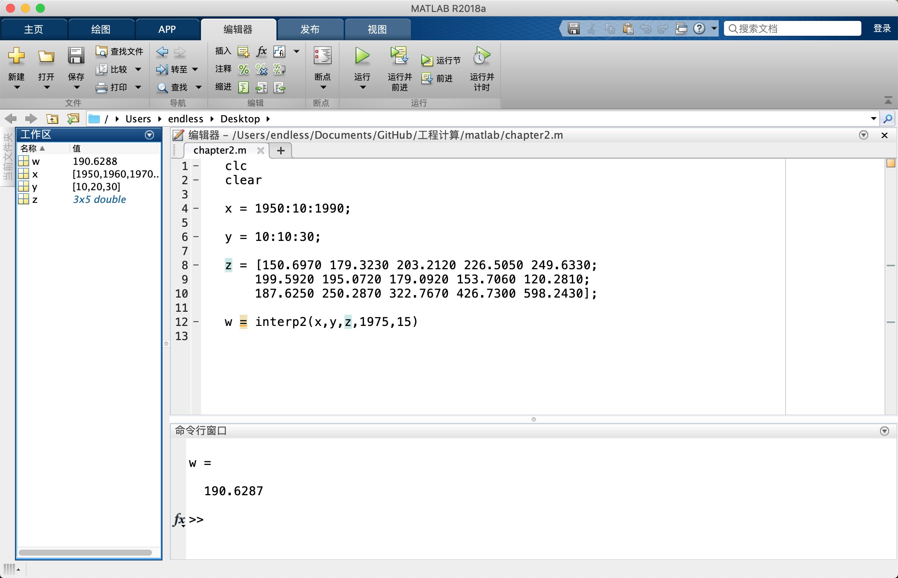
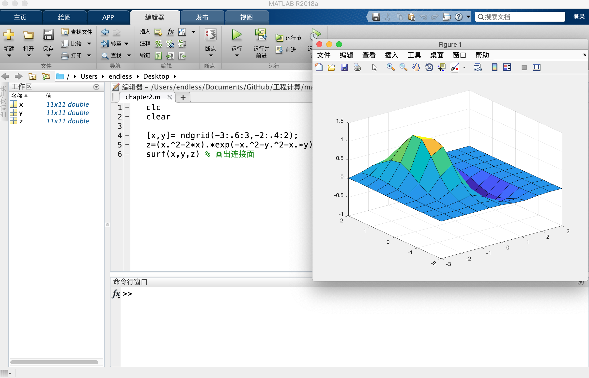
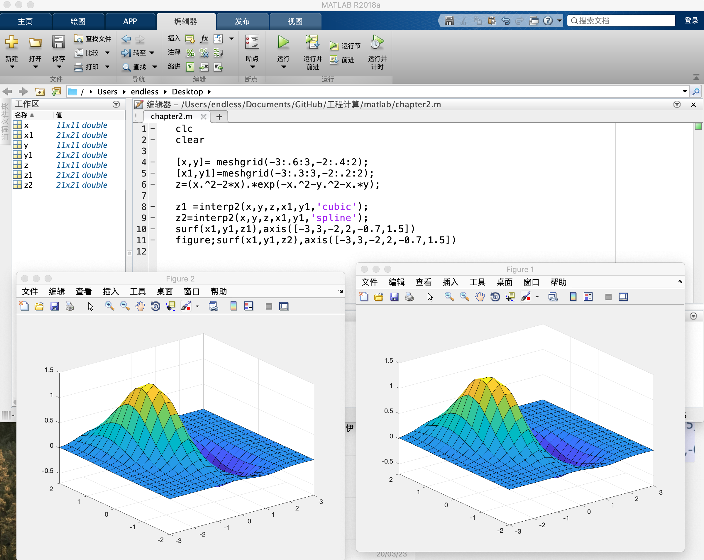
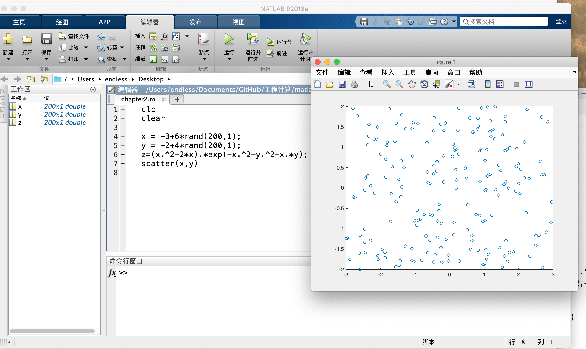
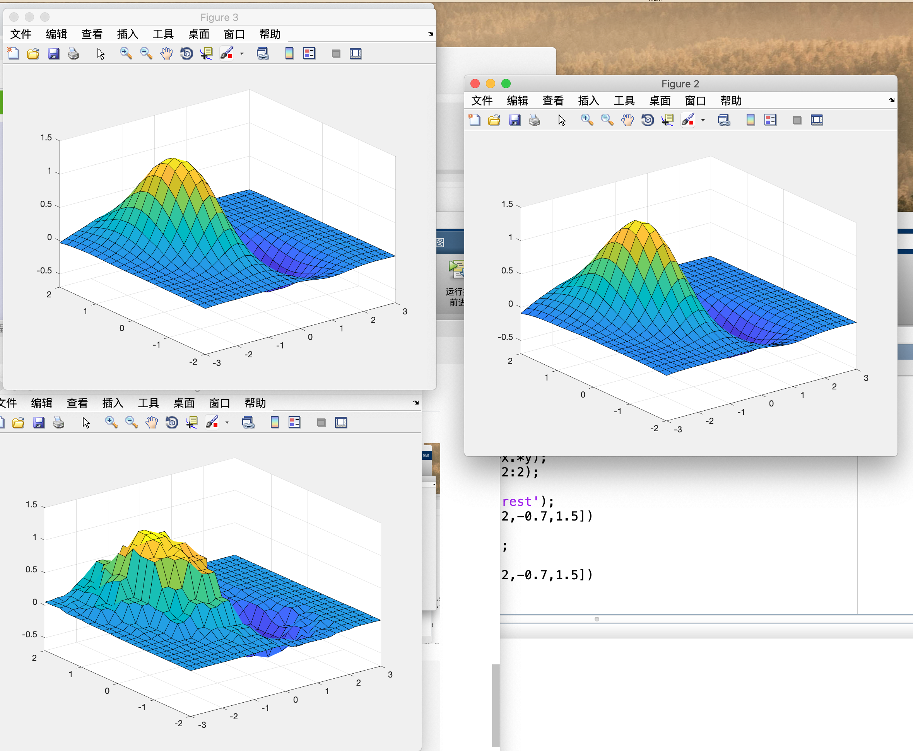
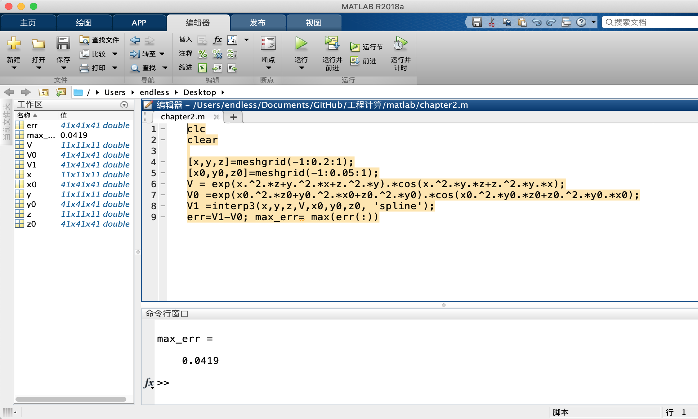
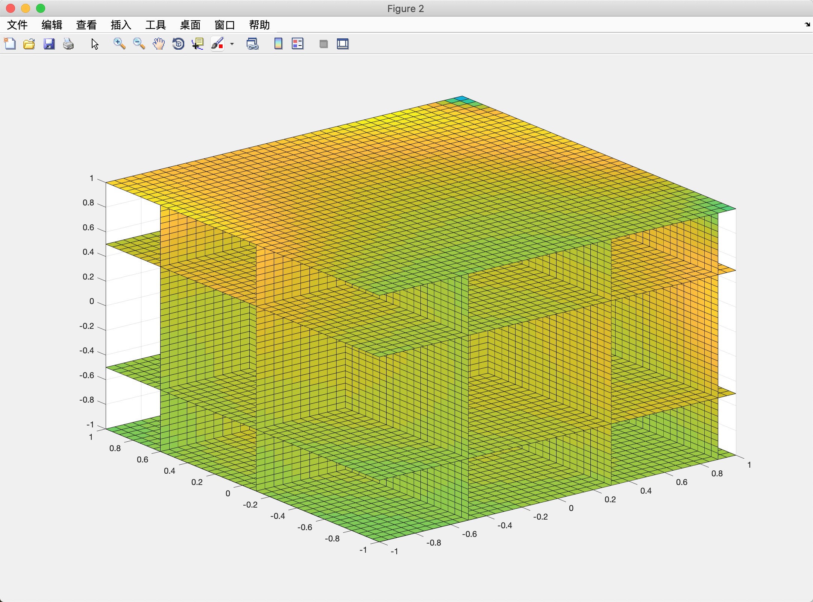

# 二维插值函数interp2
- 用于网格节点二维数据**内插值**`Zi=interp2(X,Y,Z,Xi,Yi，method)`
```
method:linear(双线性插值算法)（default）
nearest(最邻近插值)
spline(三次样条插值)
cubic（双三次插值）
```
- Xi\Yi是向量或同维矩阵，且必须单调
- Z的维数为Y*X
>例：求X = 1975, y =15的线性插值
```
clc
clear

x = 1950:10:1990;

y = 10:10:30;

Z = [150.6970 179.3230 203.2120 226.5050 249.6330; 
    199.5920 195.0720 179.0920 153.7060 120.2810; 
    187.6250 250.2870 322.7670 426.7300 598.2430];

z = interp2(x,y,z,1975,15)
```


>例2
直接画出来的网格是粗糙的

使用interp2()很好
```
clc
clear

[x,y]= meshgrid(-3:.6:3,-2:.4:2);
[x1,y1]=meshgrid(-3:.3:3,-2:.2:2);
z=(x.^2-2*x).*exp(-x.^2-y.^2-x.*y);

z1 =interp2(x,y,z,x1,y1,'cubic');
z2=interp2(x,y,z,x1,y1,'spline');
surf(x1,y1,z1),axis([-3,3,-2,2,-0.7,1.5])
figure;surf(x1,y1,z2),axis([-3,3,-2,2,-0.7,1.5])
```


## `ndgrid`和`meshgrid`的区别
>meshgrid和ndgrid的用法不同之处在于:2D、3D都可以使用(区别是x轴,y轴的转换)，但对于4D、5D...只能使用ndgrid.
为什么要使用meshgrid?
matlab使用矩阵的方式进行运算，对于2D而言，如果采样10个点(指x,y轴)，那么对于x=第一个采样点，反映到矩阵就是10个，即不管y是哪个值，x的第一采样点保持不变；对y是同理。因此，2D产生的x和y都是两维矩阵。


# `griddata` 二维一般分布插值
- 针对非网格形式的数据进行插值
- z=griddata(x0,y0,z0,x,y,',method')
- 插值算法支持v4,linear,nearest,cubic

## 例
先画出随机采点的数据

```
clc
clear

x = -3+6*rand(200,1);
y = -2+4*rand(200,1);
z=(x.^2-2*x).*exp(-x.^2-y.^2-x.*y);
[x1,y1]=meshgrid(-3:.2:3,-2:.2:2);

z1= griddata(x,y,z,x1,y1,'nearest');
surf(x1,y1,z1),axis([-3,3,-2,2,-0.7,1.5])

z2=griddata(x,y,z,x1,y1,'v4');
figure;
surf(x1,y1,z2);axis([-3,3,-2,2,-0.7,1.5])


```


# `griddata3` 三维插值拟合函数
采用非网格形式的插值拟合

# N维插值函数
- interp**n** 调用格式同interp2
- griddata**n** 同griddata

## 例

对比最大误差
```clc
clear

[x,y,z]=meshgrid(-1:0.2:1);
[x0,y0,z0]=meshgrid(-1:0.05:1);
V = exp(x.^2.*z+y.^2.*x+z.^2.*y).*cos(x.^2.*y.*z+z.^2.*y.*x);
V0 =exp(x0.^2.*z0+y0.^2.*x0+z0.^2.*y0).*cos(x0.^2.*y0.*z0+z0.^2.*y0.*x0);
V1 =interp3(x,y,z,V,x0,y0,z0, 'spline');
err=V1-V0; max_err= max(err(:))
```




## `slice`切片